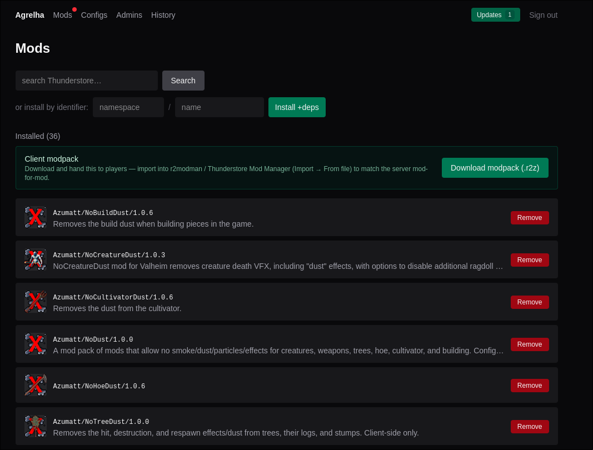
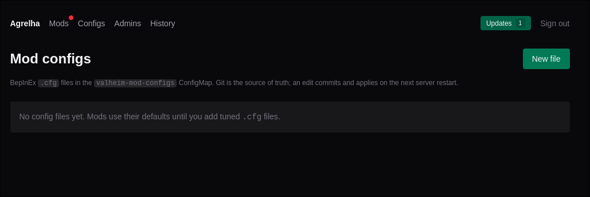
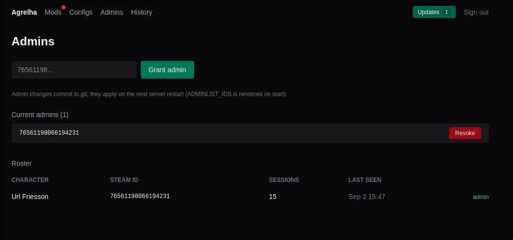

# agrelha

Single-user web UI to manage the Valheim gameserver running on the `yaya` Talos
cluster. Go + Fiber + templ + Tailwind + **Datastar** (SSE). Deployed via GitOps
from [yaya-ops](https://codeberg.org/ykhi/yaya-ops); image hosted in the
self-hosted Zot registry at `registry.ykhi.xyz/agrelha`.

## Screenshots

### Homepage


### Mod management


### Configuration


### Admin management


### History page


## Architecture — two-plane hybrid

The `valheim` ArgoCD app has `selfHeal: true`, so live cluster edits get reverted.
agrelha therefore treats state and actions differently:

- **Declarative plane (git):** mods (`valheim-mods` ConfigMap), mod `.cfg` files
  (`valheim-mod-configs`), and the admin list (`valheim-admins`) → agrelha commits
  to `yaya-ops@main` (Codeberg bot token) → ArgoCD syncs → rollout. After each
  commit a background watcher polls the live ConfigMap until ArgoCD reconciles,
  then rolls the pod so the change actually takes effect.
- **Imperative plane (k8s API):** restart / stop / start / logs / pod metrics →
  `client-go` against a ServiceAccount scoped to the `valheim` namespace (no exec).

Auth: in-app **Zitadel OIDC**, single permitted identity (`ALLOWED_EMAIL`),
stateless HMAC-signed session cookies. Persistence: embedded **SQLite** (modernc,
no cgo) holding the player roster/presence, action audit, server-event timeline,
and the Thunderstore mod index + README cache.

## Features

- **Dashboard** — live tiles (online players, CPU, memory, uptime) and a live log
  tail over SSE; last-backup summary from the NFS-mounted NAS export; Restart /
  Update / Stop / Start controls; deep-link to the Grafana Valheim dashboard.
- **Mods** — search/browse Thunderstore (background-indexed, instant), per-mod
  detail pages (README, dependencies), install-with-dependency-resolution and
  remove (git-committed). **Update detection**: a red dot + popover show which
  installed mods have newer versions (current → latest) with Update all / Update
  selected (full dependency re-resolve, auto-restart). **Modpack export**:
  download a `.r2z` profile of the installed mods + configs to import into
  r2modman / Thunderstore Mod Manager.
- **Configs** — edit mod `.cfg` files (the `valheim-mod-configs` ConfigMap).
- **Admins** — grant/revoke in-game admin by Steam64, picked from the auto-built
  player roster or entered manually.
- **History** — merged audit + server-event timeline.
- **Observability** — structured `slog` logging; Prometheus `/metrics` (HTTP, SSE,
  control-action, and Go runtime series) scraped into the cluster's InfluxDB.

## Layout

Layered: `domain` knows nothing, `ports` declares every seam, and dependencies
point inward. Enforced by an architecture test (see
`docs/architecture-cleanup-plan.md`).

```
cmd/agrelha/             composition root: config -> adapters -> services -> routes
internal/domain/         entities, value objects, invariants. Imports nothing.
internal/ports/          the interfaces: StateStore, Reconciler, Runtime,
                         InstanceRepository, ContentProvider, Game, Auth
internal/app/            application services
  mods/                  Valheim mod list
  admins/                Valheim operators
  games/                 per-game behaviour (Valheim, Minecraft)
  ingest/                log-tailing -> player roster/presence
internal/infra/          adapters. Swap these, not the layers above.
  store/                 SQLite schema + queries (roster, audit, mod index)
  kube/                  client-go: restart/scale/status/metrics/logs
  gitops/                go-git clone -> edit YAML -> commit/push
  state/                 StateStore: git | local | unconfigured
  reconcile/             Reconciler: argocd | compose
  runtime/               Runtime: k8s | docker
  content/               modrinth | thunderstore | modpackindex | mcversions
  auth/                  oidc | local users
  backups/               NAS backup dir stat
internal/web/            delivery
  pages/*.templ          Layout, nav, dashboards, mods, configs, access, wizard
  handlers/              per-feature HTTP handlers
  shared/                actor, flash, format, render, SSE helpers
  sse/                   hand-written Datastar frames (patch-signals/elements)
  mdrender/              README markdown -> sanitised HTML + image proxy
  metrics/               Prometheus collectors
  assets/                css (Tailwind v4) + js (vendored Datastar v1.0.2)
internal/platform/       cross-cutting: config, logging, build info
internal/minecraft/      Minecraft instances (being split across the layers above)
internal/modpack/        .mrpack / .r2z pack builders
internal/server/         Fiber wiring (being dissolved into cmd/ and web/)
```

## Dev

```sh
mise install          # go, bun, templ, air, task
cp .env.example .env  # leave OIDC_ISSUER empty to bypass auth locally
go mod tidy           # generates go.sum + resolves k8s/oidc deps
task build            # templ generate + tailwind + vendor datastar + go build
task watch            # air live-reload
go test ./...         # unit tests (server package)
```

Key env vars (see `.env.example`): `OIDC_*` + `ALLOWED_EMAIL` (auth),
`GIT_REPO_URL` / `CODEBERG_USERNAME` / `CODEBERG_TOKEN` (declarative plane),
`MODS_PATH` / `ADMINS_PATH` / `MOD_CONFIGS_PATH` (target files in the repo),
`VALHEIM_NAMESPACE` / `VALHEIM_DEPLOYMENT` (imperative plane),
`BACKUPS_DIR`, `INFLUXDB_URL`, `GRAFANA_DASHBOARD_URL`, `LOG_LEVEL` / `LOG_FORMAT`.

## Ship

```sh
task build:image TAG=0.8.7      # docker build + push to registry.ykhi.xyz/agrelha
# then bump the image tag in yaya-ops manifests/agrelha-app.yaml and commit
```

See `plan.md` for the full feature/version changelog and remaining work.

## Licence

AGPL-3.0-only. Copyright (C) 2026 ykhi <agrelha@ykhi.xyz>. See [LICENSE](LICENSE).

If you modify agrelha and let other people use it over a network, section 13
obliges you to offer them your source. agrelha ships a footer link for exactly
that — point `SOURCE_URL` at your own repository and you are covered.

Embedded third-party assets and their notices are listed in
[third_party/](third_party/README.md).
