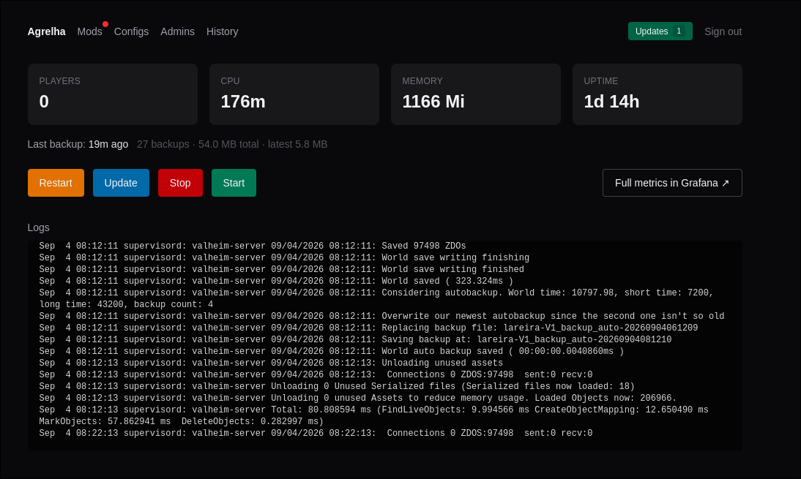
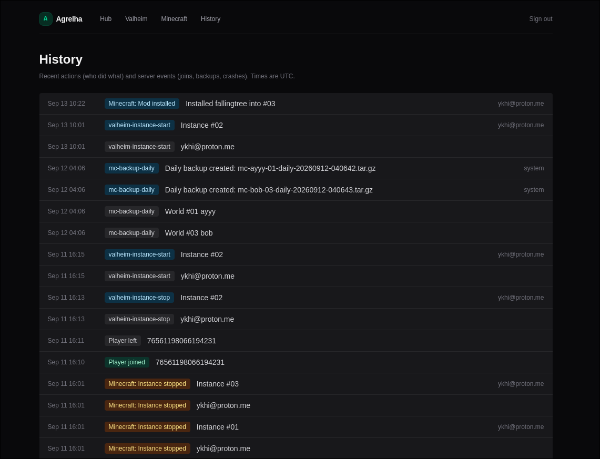
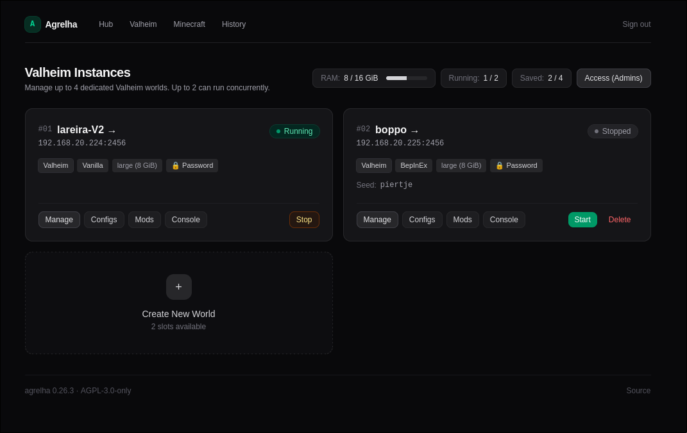
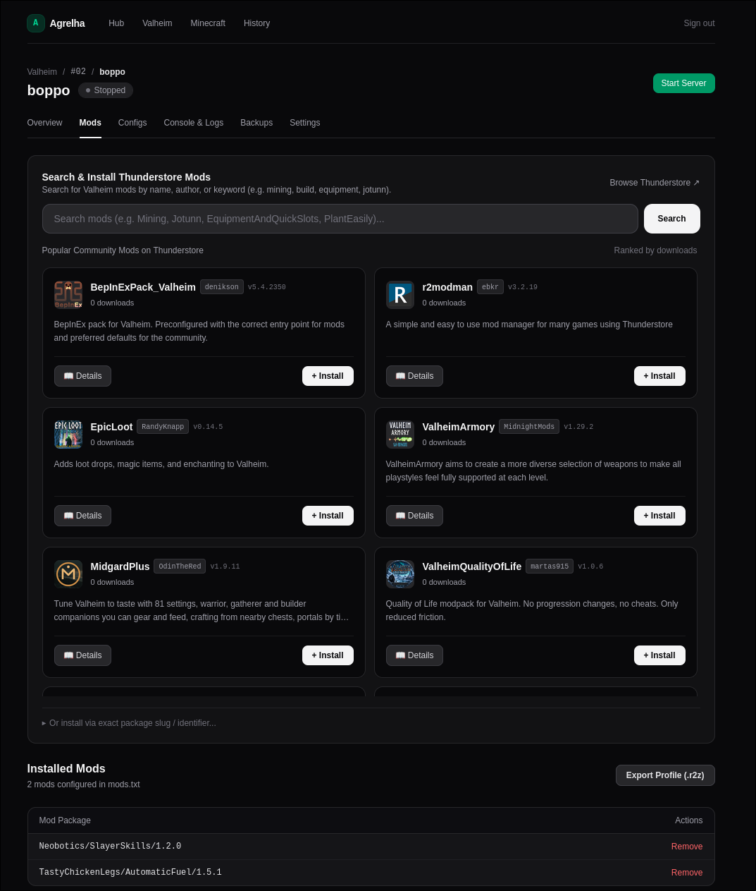
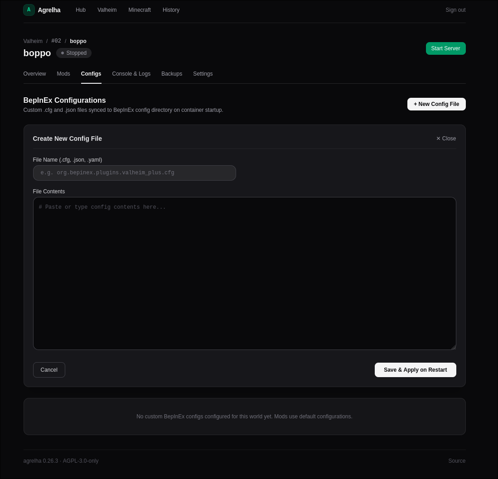
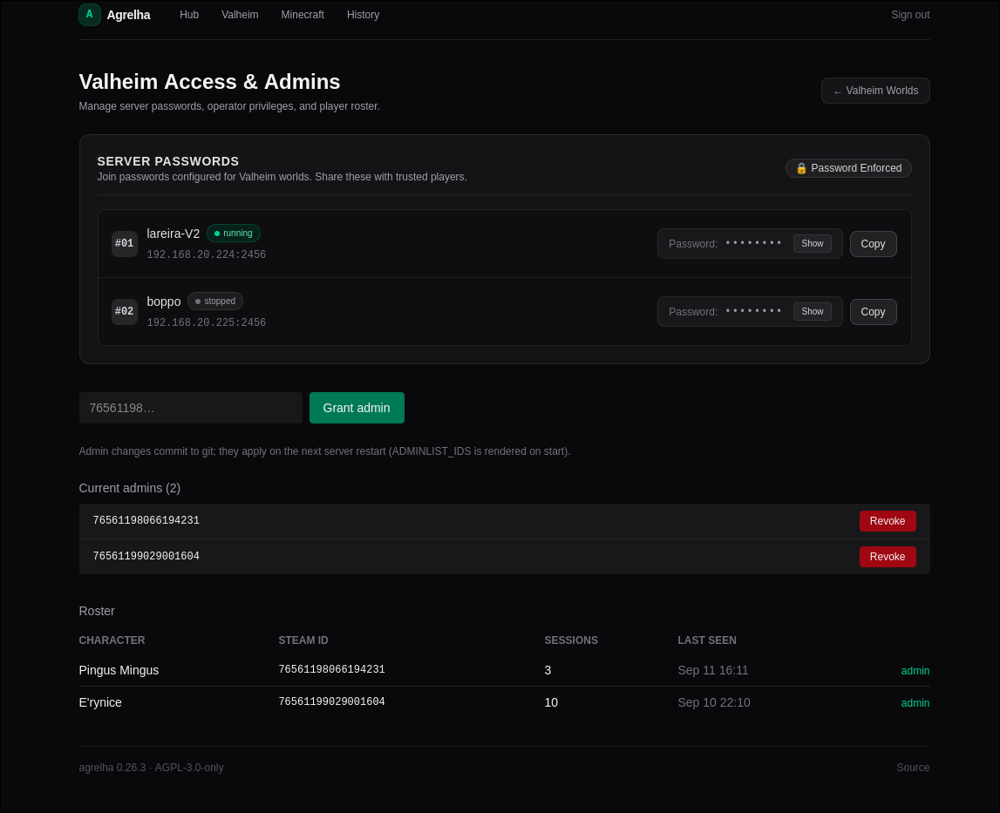
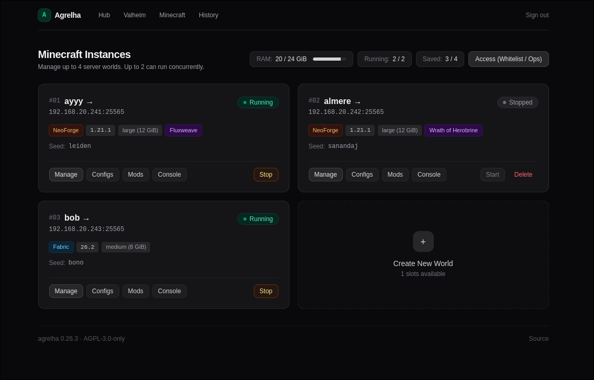
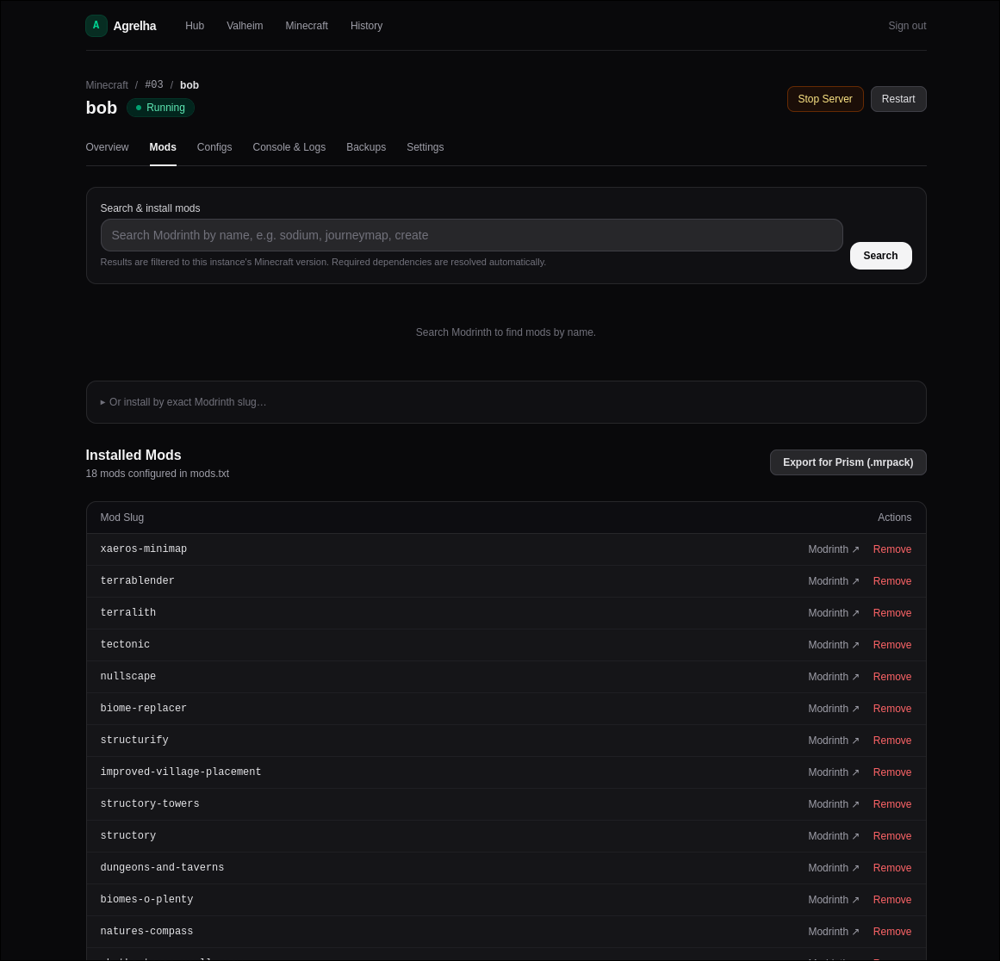
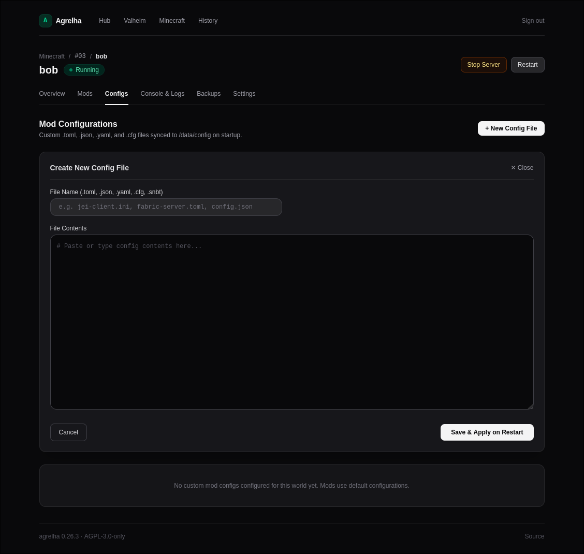
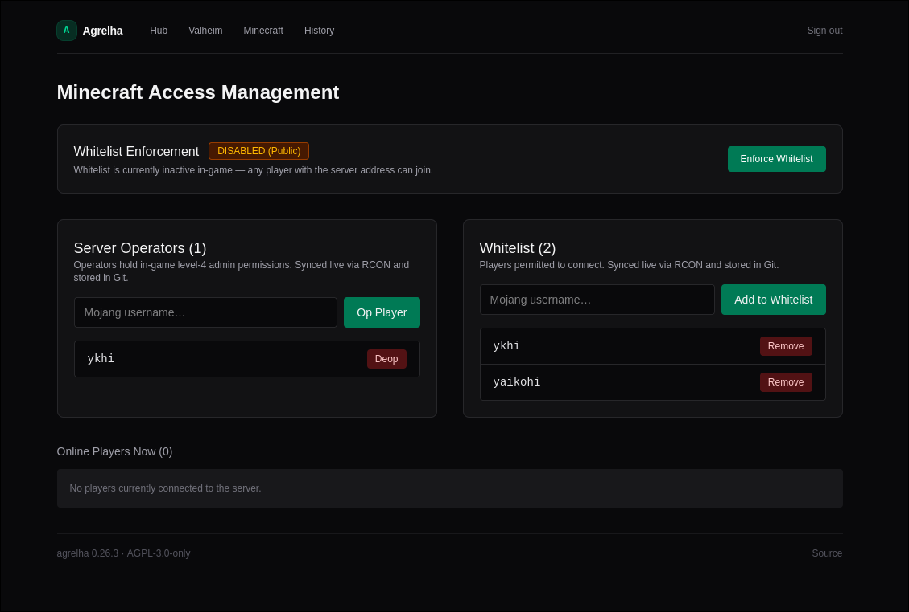

# agrelha

Web control panel for dedicated game servers. Runs several **Valheim** and
**Minecraft** worlds side by side within a fixed RAM budget: create them, install
mods, edit configs, watch logs, take backups, and hand players a matching client
profile.

Go + Fiber + templ + Tailwind + **Datastar** (SSE), an embedded SQLite database,
and no runtime dependencies beyond the container. Deploy to Kubernetes with the
[Helm chart](deploy/helm/agrelha) or via GitOps; a Docker/Compose path exists but
is not finished (see [Status](#status-and-whats-planned)). AGPL-3.0-only.

## Screenshots

### Homepage


### History page



#### Valheim


##### Mod management


##### Configuration


##### Access management



#### Minecraft


##### Mod management


##### Configuration


##### Access management


## Architecture — two-plane hybrid

agrelha separates **what a server should be** from **what it is doing right now**,
because the two have different owners and different failure modes.

- **Declarative plane** — mods, configs and access are desired state. agrelha
  writes them to a store and something else reconciles: commits to git for
  ArgoCD to sync, or local files for Compose. Live cluster edits would be
  reverted by `selfHeal`, so agrelha never makes them.
- **Imperative plane** — start, stop, restart, logs and metrics act on the
  running server directly, through `client-go` or the Docker API.

Both planes sit behind ports, so the runtime is a wiring choice rather than a
rewrite:

| Port | Kubernetes | Docker |
|---|---|---|
| `StateStore` — where desired state lives | git | local files |
| `Reconciler` — how it becomes real | ArgoCD | Compose |
| `Runtime` — start/stop/logs/metrics | client-go | Docker API |
| `SpecRenderer` — what desired state looks like | manifests | *planned* |

Layers run `domain → ports → app → infra / web`, with dependencies pointing
inward and an architecture test that fails the build on a forbidden import.
[docs/architecture.md](docs/architecture.md) is the full picture: the layers and
why they are split that way, the import matrix, how each layer is tested, and a
one-line purpose for every package under `internal/`.

**Auth** is OIDC (any provider) with an allow-list, or local Argon2id accounts
when there is no IdP. **Persistence** is embedded SQLite (modernc, no cgo):
player roster and presence, audit log, server events, crash incidents, and the
mod index cache.

## Who it's for

agrelha began as one person's control plane for one homelab. The goal is a panel
someone else can install without adopting that homelab. Three audiences, in
shipping order:

| # | Audience | Status |
|---|---|---|
| 1 | **GitOps homelabbers on Kubernetes** — git owns desired state, the cluster owns actions | **Supported.** This is what agrelha runs on today |
| 2 | **Self-hosters on Docker / Compose** | **Partial** — adapters exist and the app boots, but no game server reaches a container yet. See [docs/docker-runtime-plan.md](docs/docker-runtime-plan.md) |
| 3 | **Friend-group admins who want no infrastructure** | Not a third adapter — audience 2 plus a good install story |

It manages **Valheim** and **Minecraft** side by side, several worlds per game,
within a fixed RAM budget.

## Features

Everything below works today for **both games** unless noted.

**Worlds**
- Several worlds per game, each with its own deployment, volume, service and
  config. Numbered slots with a RAM budget and a concurrency cap; tiers are
  small (4 GiB), medium (8) and large (12).
- Creation wizard — identity, content, tier — or import an existing `.r2z`,
  `export.r2x`, `.mrpack` or Prism instance zip.
- Start / stop / restart per world, gated by the budget so a start that cannot
  fit is refused with a reason rather than OOM-killed.
- **Valheim: Vanilla or Modded.** Vanilla runs without BepInEx, which is the only
  way Steam achievements stay earnable, and is immutable afterwards.

**Mods**
- Search Modrinth (Minecraft) and Thunderstore (Valheim) by name, install with
  automatic dependency resolution, remove.
- Versions are **pinned at install time**, so an export reproduces exactly what
  the server runs rather than guessing "latest".
- Client profile export — `.mrpack` for Prism / Modrinth App, `.r2z` for
  r2modman / Thunderstore Mod Manager — so players match the server mod-for-mod.
- Per-world mod config editing.

**Operations**
- Console and live log streaming over SSE; RCON for Minecraft.
- Backups: create, download, delete, restore in place, or restore into a new
  world.
- **Crash detection** — when a server dies, agrelha records an incident with the
  exit code, restart count, OOM flag and the log tail captured from the
  *terminated* container, and shows the cause on the world's page.
- Health is a real protocol check (`mc-health`, Valheim game-port bind), so
  "Online" means players can connect rather than "the process exists".

**Access**
- Minecraft: whitelist and operators. Valheim: admin list by Steam64 and a server
  password. Player roster built automatically from server logs.

**The panel itself**
- Player-facing hub listing joinable worlds and their connect addresses;
  operator views behind auth.
- Sign in with OIDC, or local accounts (Argon2id) when you have no IdP.
- Audit and event history — who did what, and what the servers did.
- Structured `slog` logging and a Prometheus `/metrics` endpoint.

## Status and what's planned

agrelha runs daily on the cluster it was built for. Two structural projects are
complete and proven by tests rather than assertion:

- **Modularization** (phases 0-9) — ports and adapters, a domain layer, a
  composition root, Helm chart and compose file. [docs/modularization-plan.md](docs/modularization-plan.md)
- **Architecture cleanup** (phases A-I) — `domain / ports / app / infra / web`,
  enforced by an architecture test whose violation ledger is now **empty**.
  [docs/architecture-cleanup-plan.md](docs/architecture-cleanup-plan.md)

Planned, designed but not built:

| Feature | State | Plan |
|---|---|---|
| **Docker runtime, end to end** | Phase 1 of 7 done. Adapters exist; nothing renders a compose file yet | [docs/docker-runtime-plan.md](docs/docker-runtime-plan.md) |
| **Mod-combination compatibility gate** | Designed. Static Modrinth-metadata checks before a world is created, plus an optional boot smoke test | [docs/mod-compatibility-plan.md](docs/mod-compatibility-plan.md) |
| **Duplicate a world** | Designed. Copy the world or start fresh from the same seed — the supported way to make a Vanilla world Modded | [CONTEXT.md](CONTEXT.md) |
| **Incident history** | Incidents are recorded and only the latest is shown | [docs/server-health-plan.md](docs/server-health-plan.md) |
| **Backups on Docker** | Out of scope until the volume model is settled | [docs/docker-runtime-plan.md](docs/docker-runtime-plan.md) |
| **Zero-downtime HA (rqlite)** | Sketched only | [plan.md](plan.md) |

Known limits worth stating plainly: CurseForge packs that block third-party
distribution can never be installed automatically, and Valheim mod compatibility
cannot be checked before boot because Thunderstore exposes no game-version field.

## Layout

Layered: `domain` knows nothing, `ports` declares every seam, and dependencies
point inward. Enforced by an architecture test (see
`docs/architecture-cleanup-plan.md`).

```
cmd/agrelha/             composition root: config -> adapters -> services -> routes
internal/domain/         entities, value objects, invariants. Imports nothing.
internal/ports/          the interfaces: StateStore, Reconciler, Runtime,
                         InstanceRepository, ContentProvider, Game, Auth
internal/app/            application services
  mods/                  Valheim mod list
  admins/                Valheim operators
  games/                 per-game behaviour (Valheim, Minecraft)
  ingest/                log-tailing -> player roster/presence
internal/infra/          adapters. Swap these, not the layers above.
  store/                 SQLite schema + queries (roster, audit, mod index)
  kube/                  client-go: restart/scale/status/metrics/logs
  gitops/                go-git clone -> edit YAML -> commit/push
  state/                 StateStore: git | local | unconfigured
  reconcile/             Reconciler: argocd | compose
  runtime/               Runtime: k8s | docker
  content/               modrinth | thunderstore | modpackindex | mcversions
  auth/                  oidc | local users
  backups/               NAS backup dir stat
internal/web/            delivery
  pages/*.templ          Layout, nav, dashboards, mods, configs, access, wizard
  handlers/              per-feature HTTP handlers
  shared/                actor, flash, format, render, SSE helpers
  sse/                   hand-written Datastar frames (patch-signals/elements)
  mdrender/              README markdown -> sanitised HTML + image proxy
  metrics/               Prometheus collectors
  assets/                css (Tailwind v4) + js (vendored Datastar v1.0.2)
internal/platform/       cross-cutting: config, logging, build info
internal/minecraft/      Minecraft instances (being split across the layers above)
internal/modpack/        .mrpack / .r2z pack builders
internal/server/         Fiber wiring (being dissolved into cmd/ and web/)
```

## Dev

```sh
mise install          # go, bun, templ, air, task
cp .env.example .env  # leave OIDC_ISSUER empty to bypass auth locally
go mod tidy           # generates go.sum + resolves k8s/oidc deps
task build            # templ generate + tailwind + vendor datastar + go build
task watch            # air live-reload
go test ./...         # unit tests (server package)
```

Key env vars (see `.env.example`): `OIDC_*` + `ALLOWED_EMAIL` (auth),
`GIT_REPO_URL` / `CODEBERG_USERNAME` / `CODEBERG_TOKEN` (declarative plane),
`MODS_PATH` / `ADMINS_PATH` / `MOD_CONFIGS_PATH` (target files in the repo),
`VALHEIM_NAMESPACE` / `VALHEIM_DEPLOYMENT` (imperative plane),
`BACKUPS_DIR`, `INFLUXDB_URL`, `GRAFANA_DASHBOARD_URL`, `LOG_LEVEL` / `LOG_FORMAT`.

## Install

Kubernetes, via the chart — the namespaces you list must already exist, and
agrelha is never granted cluster-wide permissions:

```sh
helm install agrelha ./deploy/helm/agrelha \
  --namespace agrelha --create-namespace \
  --set image.repository=ghcr.io/OWNER/agrelha \
  --set 'gameNamespaces={valheim,minecraft}'
```

Every configuration key has a default, so nothing is required beyond `RUNTIME`
when running off Kubernetes. See [deploy/README.md](deploy/README.md) for the
Docker path and [docs/configuration.md](docs/configuration.md) for what each key
turns on.

## Ship

```sh
task build:image TAG=0.26.2     # docker build + push; TAG stamps the binary
# then bump the image tag wherever your GitOps repo declares it
```

See `plan.md` for the version changelog and remaining work.

## Licence

AGPL-3.0-only. Copyright (C) 2026 ykhi <ykhi@proton.me>. See [LICENSE](LICENSE).

If you modify agrelha and let other people use it over a network, section 13
obliges you to offer them your source. agrelha ships a footer link for exactly
that — point `SOURCE_URL` at your own repository and you are covered.

Embedded third-party assets and their notices are listed in
[third_party/](third_party/README.md).
